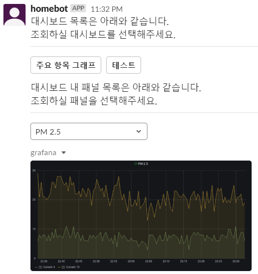

# Botkit for Grafana

## Availabe commands

- `대시보드` : show dashboard list
  - block conversation starts and you can get panels and rendered panel image from specific dashboard
  - 

## ngrok usage

`ngrok http 3000`
